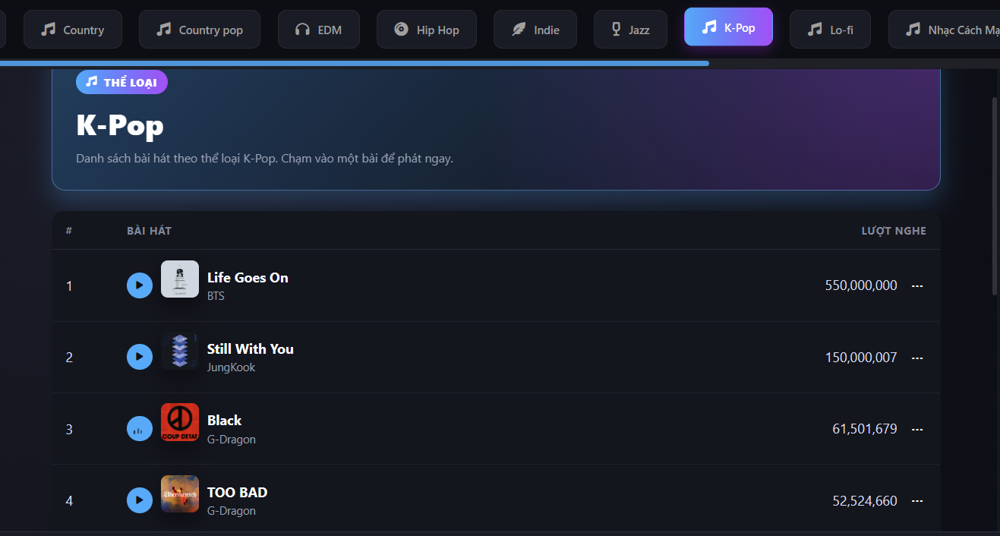
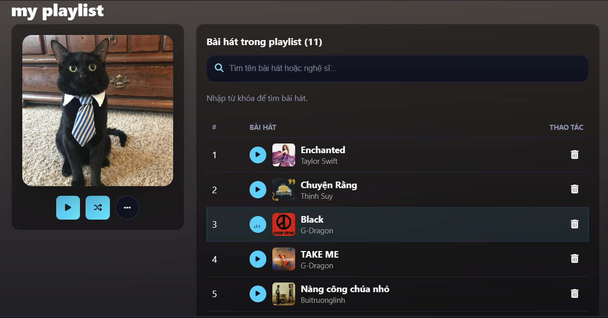
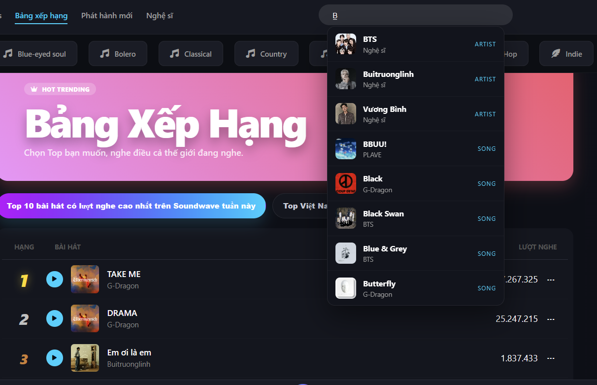

# 🎧 MusicWeb — Trải nghiệm âm nhạc không giới hạn

> **Sứ mệnh:** Mang đến một không gian nghe nhạc mượt mà, đầy cảm xúc và hoàn toàn tùy biến cho mỗi cá nhân. Với giao diện trực quan và khả năng quản lý thư viện âm nhạc thông minh, MusicWeb giúp bạn dễ dàng kết nối với những giai điệu yêu thích nhất.

  <!-- Thay thế đường dẫn bằng ảnh thực tế của bạn -->
  

---

## ✨ Tính năng nổi bật

### 🎶 Trải nghiệm cốt lõi
- 🔊 **Phát nhạc mượt mà:** Luồng phát ổn định, tương thích với nhiều định dạng audio chất lượng cao.
- 📝 **Lời bài hát Karaoke-style (AJAX):** Hiển thị lời bài hát (file `.lrc`) đồng bộ theo thời gian thực mà không cần tải lại trang.
- 📱 **Thiết kế Responsive:** Giao diện thích ứng hoàn hảo trên mọi kích thước màn hình (Desktop, Tablet, Mobile).

### 👤 Cá nhân hóa & Tương tác
- 🎧 **Quản lý Playlist:** Tự do tạo, chỉnh sửa và chia sẻ các danh sách phát theo tâm trạng cá nhân.
- ❤️ **Thư viện yêu thích:** Thêm bài hát hoặc ca sĩ vào mục yêu thích để truy cập nhanh bằng một cú nhấp chuột.
- ⏱️ **Lịch sử nghe nhạc:** Tự động lưu lại các track đã nghe, giúp bạn dễ dàng tìm lại những giai điệu vừa lướt qua.
- 🖼️ **Tùy chỉnh giao diện:** Hỗ trợ người dùng tải lên Avatar cá nhân và ảnh bìa (cover) riêng cho từng playlist.

### 🌍 Khám phá & Cập nhật
- 📈 **Bảng xếp hạng (Charts):** Cập nhật liên tục top các bài hát và xu hướng thịnh hành nhất thông qua `ChartRankingService`.
- 🎤 **Hệ sinh thái Nghệ sĩ/Album:** Trang thông tin chi tiết cho từng nghệ sĩ và album, đính kèm danh sách bài hát liên quan.
- 🔔 **Tin tức & Thông báo:** Hệ thống cập nhật tin tức âm nhạc và thông báo hoạt động real-time.
- 🔑 **Đăng nhập nhanh:** Tích hợp xác thực qua tài khoản mạng xã hội (Google Login).

---

## 📸 Giao diện sản phẩm

  

 

  
  &nbsp;&nbsp;&nbsp;&nbsp;
  

---

## 💡 Tại sao bạn nên chọn MusicWeb?

*   **Tối ưu hóa trải nghiệm:** Mọi thao tác từ tìm kiếm, tạo playlist đến chuyển bài đều được thiết kế tối giản và nhanh chóng.
*   **Tương tác sống động:** Lời bài hát đồng bộ giúp bạn dễ dàng hòa mình và hát theo ca khúc yêu thích.
*   **Không bao giờ lỡ nhịp:** Luôn nắm bắt xu hướng nhạc mới nhất qua Bảng xếp hạng và hệ thống Tin tức tích hợp.

---

## 🛠️ Công nghệ sử dụng (Tech Stack)

*   **Backend:** PHP, Laravel Framework
*   **Frontend:** HTML/CSS, JavaScript (AJAX)
*   **Database:** MySQL
*   **Quản lý phiên bản:** Git & GitHub

---

## 🚀 Hướng dẫn sử dụng nhanh

1.  **Bắt đầu:** `Đăng ký / Đăng nhập` vào hệ thống (có thể dùng Google Login).
2.  **Khám phá:** Nhập tên bài hát hoặc nghệ sĩ vào thanh `Tìm kiếm` (Search).
3.  **Tận hưởng:** Nhấn `Play` để nghe và theo dõi lời bài hát hiển thị.
4.  **Lưu trữ:** Nhấn icon `❤️` hoặc chọn `Thêm vào Playlist` để lưu trữ ca khúc.
5.  **Quản lý:** Truy cập mục `Lịch sử` hoặc `Trang cá nhân` để xem lại hoạt động nghe nhạc của bạn.
